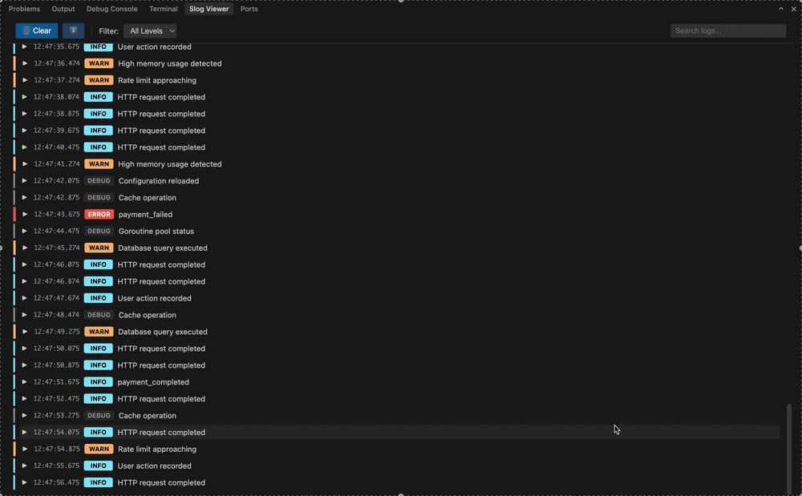

# Slog Viewer

Beautiful structured log viewer for debugging. Automatically transforms JSON/logfmt logs into readable, interactive output with syntax highlighting, filtering, and search.



## Features

- **Automatic Detection**: Detects and formats JSON/logfmt logs during debugging
- **Interactive UI**: Modern webview with VSCode theme integration
- **Advanced Filtering**: Click any field to include/exclude logs by value
- **Filtering & Search**: Filter by log level and search across messages
- **Collapsible Fields**: Click to expand/collapse JSON
- **Works with Any Language**: Go slog, Node.js pino, Python structlog, and more

## Quick Start

1. Install the extension
2. Start debugging (F5)
3. View formatted logs in the **Slog Viewer** panel

## Supported Formats

**JSON**
```json
{"time":"2025-01-01T00:00:00Z","level":"info","message":"Server started","port":8080}
```

**Logfmt**
```
time=2025-01-01T00:00:00Z level=info msg="Server started" port=8080
```

## Advanced Filtering


1. **Click any value** - Click on a log message or any JSON field value to open the filter menu
2. **Include/Exclude** - Choose to show only logs with that value, or hide logs with that value
3. **Filter chips** - Active filters appear as chips below the toolbar
   - Green chips = include filters
   - Red chips = exclude filters
   - Click a chip to toggle it on/off
   - Click × to remove a filter
4. **Add Filter button** - Manually create filters for any field

**Example**: To hide all "http request" logs, click on a message containing "http request" and select "Exclude".

## Configuration

Access via VSCode Settings → "Slog Viewer":

- Toggle automatic formatting
- Collapse JSON by default
- Auto-scroll to latest logs
- Theme: light, dark, or auto

## License

MIT

